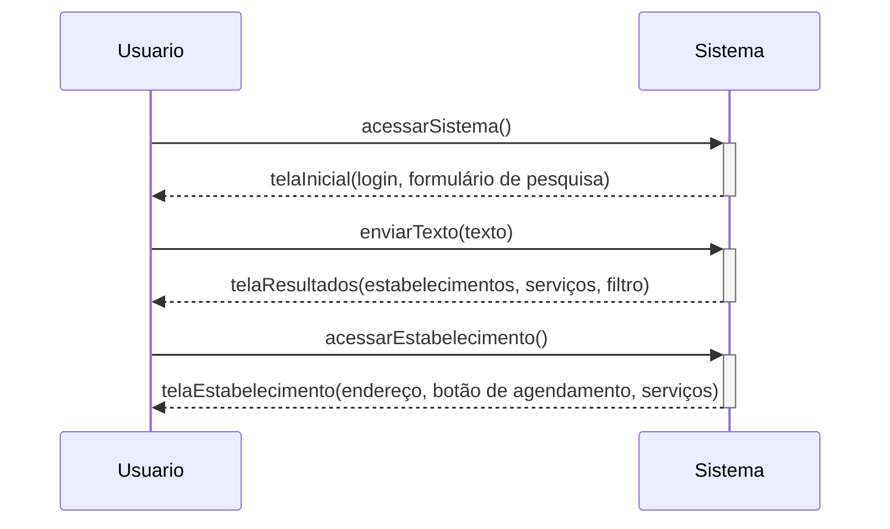

# Acessar Estabelecimento

## Descrição

O usuário insere um texto numa caixa dedicada para busca, é retornado os resultados da pesquisa e o usuário acessa um estabelecimento

## Atores

- visitante
  - Humano
  - Primário
  - Ativo
- cliente
  - Humano
  - Primário
  - Ativo

## Gatilhos

Não se aplica

## Pré-condições

Não se aplica

## Pós-condições

- A página de detalhes do estabelecimento é mostrada na tela

## Fluxo Principal

_Após o caso [CDU-BuscarEstabelecimentoServico]_

1. O usuário acessa a página de um estabelecimento do resultado da pesquisa

_**Ponto de extensão:**_
[`CDU - Acessar Serviço`](./CDU-AcessarServico.md)

## Fluxos Alternativos

Não se aplica

## Situações de Erro

### Texto Vazio Enviado

Consequência: O caso de uso é reiniciado.

## Diagrama

