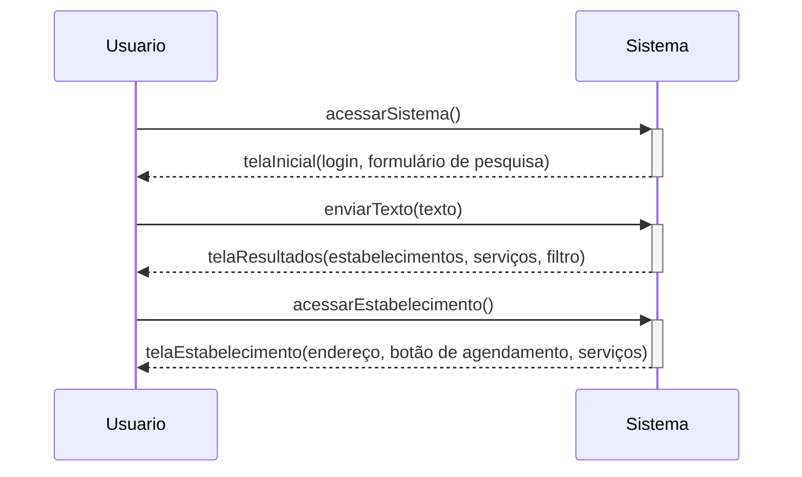

# Acessar Estabelecimento

## Descrição

O usuário insere um texto numa caixa dedicada para busca, é retornado os resultados da pesquisa e o usuário acessa um estabelecimento

## Atores

- Usuário
  - Humano
  - Primário
  - Ativo

## Gatilhos

Não se aplica

## Pré-condições

Não se aplica

## Pós-condições

- A página de detalhes do estabelecimento é mostrada na tela

## Fluxo Principal

1. O usuário acessa o sistema
1. O sistema exibe a tela inicial contendo uma opção para login e um formulário de pesquisa
1. O usuário preenche o campo de pesquisa e envia
1. O sistema exibe a tela com resultados da pesquisa que contém estabelecimentos, serviços e  opções de filtro
1. O usuário acessa a página de um estabelecimento do resultado da pesquisa
1. O sistema exibe a tela de detalhes do estabelecimento

## Fluxos Alternativos

_**Alternativa ao passo 05**_

1. Uma mensagem de que o texto pesquisado não foi encontrado é mostrada na tela
2. Uma lista de estabelecimentos anunciantes é mostrada na tela

_O caso de uso retorna ao passo 5 do fluxo principal._

_**Alternativa ao passo 05**_

1. O usuário acessa a página de um serviço do resultado da pesquisa
1. O sistema exibe a tela de detalhes do serviço
1. O usuário acessa a página do estabelecimento que oferta o serviço

_O caso de uso retorna ao passo 6 do fluxo principal._

## Situações de Erro

### Texto Vazio Enviado

Consequência: O caso de uso é reiniciado.

## Regras de Negócio

## Diagrama

