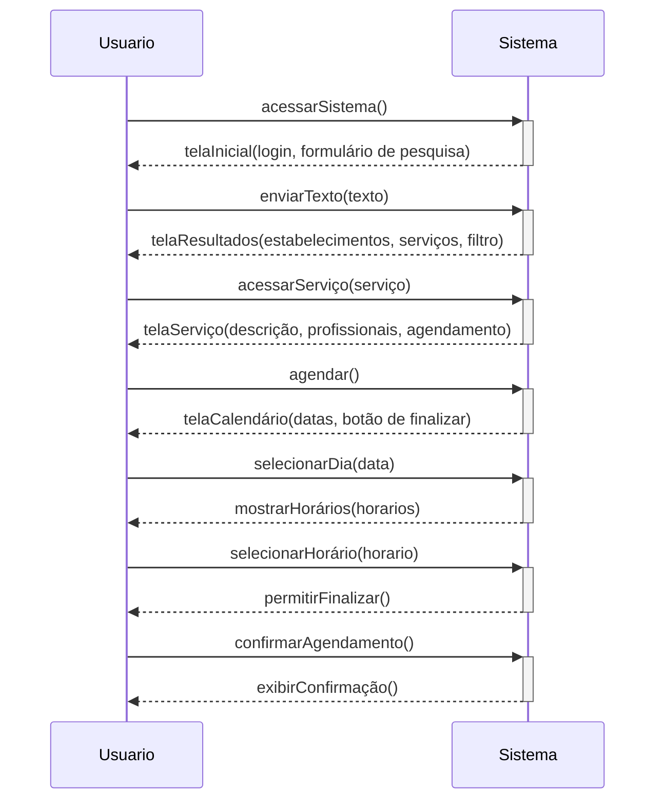
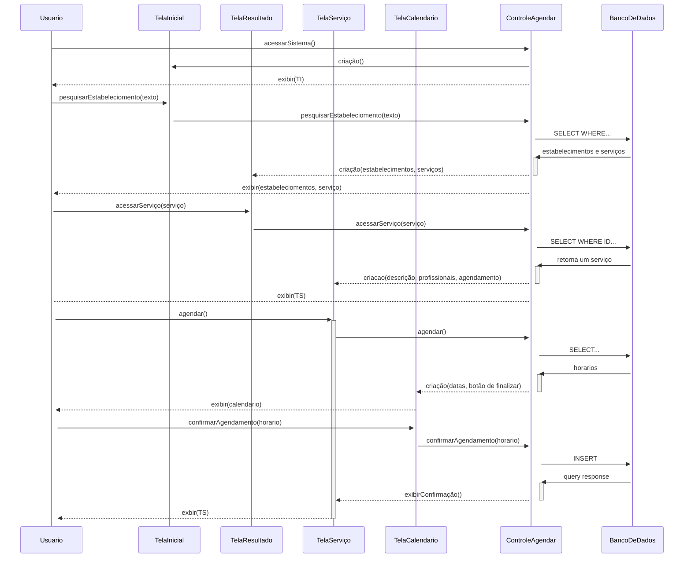

# Agendar Horário

## Descrição

O usuário escolhe um serviço e um horário disponível. Em seguida, um email é enviado para ambas as partes.

## Atores

- Usuário
  - Humano
  - Primário
  - Ativo
- Estabelecimento
  - Humano
  - Secundário
  - Passivo
- Servidor de email
  - Não humano
  - Secundário
  - Passivo

## Gatilhos

Não se aplica

## Pré-condições

- O usuário precisa estar logado

## Pós-condições

- Um email é enviado para o estabelecimento informando sobre o agendamento
- Um email é enviado para o usuário informando sobre o agendamento
- Uma faixa de horário é reservado para o agendamento do usuário

## Fluxo Principal

_Após o caso de uso [CDU-AcessarSistema]_

1. O usuário preenche o campo de pesquisa e envia
1. O sistema exibe a tela com resultados da pesquisa que contém estabelecimentos, serviços e  opções de filtro
1. O usuário acessa a página de um serviço do resultado da pesquisa
1. O sistema exibe a tela de detalhes do serviço
1. O usuário seleciona a opção "Agendar"
1. O sistema mostra uma tela com um calendário
1. O usuário seleciona um dia disponível
1. O sistema mostra uma opção para escolher um intervalo de horário
1. O usuário seleciona um intervalo de horário
1. O sistema sinaliza a possibilidade de acionar o botão para finalizar agendamento
1. O usuário aperta o botão para confirmar o agendamento
1. O sistema exibe uma mensagem de confirmação de agendamento

## Fluxos Alternativos

_**Alternativa ao passo 03**_

1. O usuário acessa a página do estabelecimento do resultado da pesquisa
1. O sistema exibe a tela de detalhes do estabelecimento
1. O usuário acessa um serviço

_O caso de uso retorna ao passo 4 do fluxo principal._

## Situações de Erro

### Não Há Faixa de Horário Disponível

Consequência: O usuário desiste de agendar horário. O caso de uso é cancelado.

### O Horário Desejado Foi Escolhido Por Outro Usuário Durante o Agendamento

Consequência: O usuário pode desistir de agendar horário, pois precisa reiniciar o caso de uso. O caso de uso é cancelado.

## Regras de Negócio

## Diagrama de Sequência do sistema

## Diagrama de Sequência

