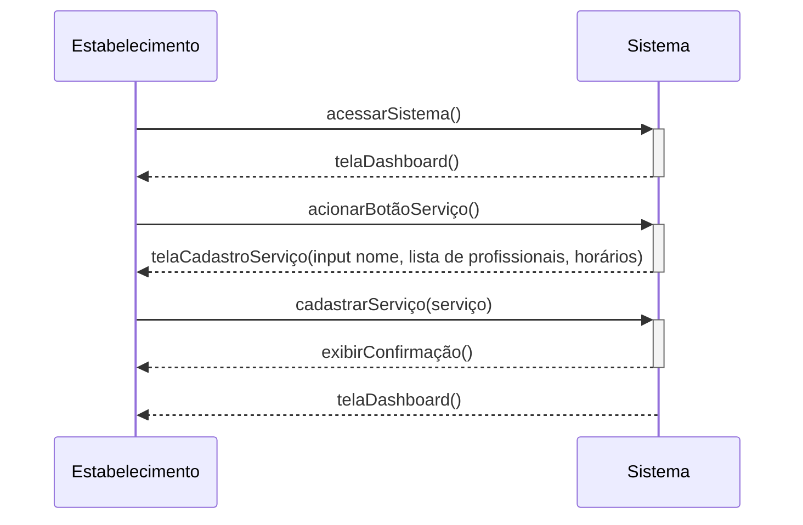

# Cadastrar Serviços

## Descrição

O estabelecimento cria um novo serviço no sistema e adiciona informações sobre ele

## Atores

- Estabelecimento
  - Humano
  - Principal
  - Ativo

## Gatilhos

Não se aplica

## Pré-condições

- Estar logado

## Pós-condições

- Ter um novo serviço cadastrado no sistema

## Fluxo Principal

1. O estabelecimento acessa o sistema
1. O sistema exibe a página de dashboard
1. O estabelecimento aciona um botão para criar novo serviço
1. O sistema mostra um formulário contendo o nome do serviço, lista de profissionais e horários para agendamento
1. O estabelecimento envia as informações preenchidas no formulário
1. O sistema exibe uma mensagem de confirmação de cadastro de serviço
1. O sistema volta para a lista de serviços

## Fluxos Alternativos

Não se aplica

## Situações de Erro

_**Dados requeridos não preenchidos**_

Consequência: O usuário pode desistir de cadastrar serviço.

## Regras de Negócio

## Diagrama

